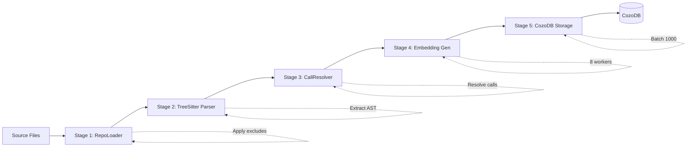
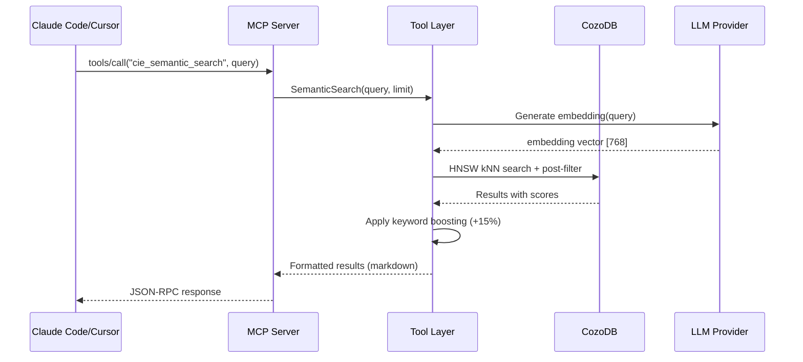
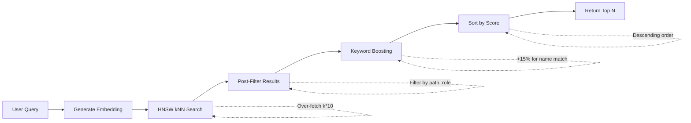
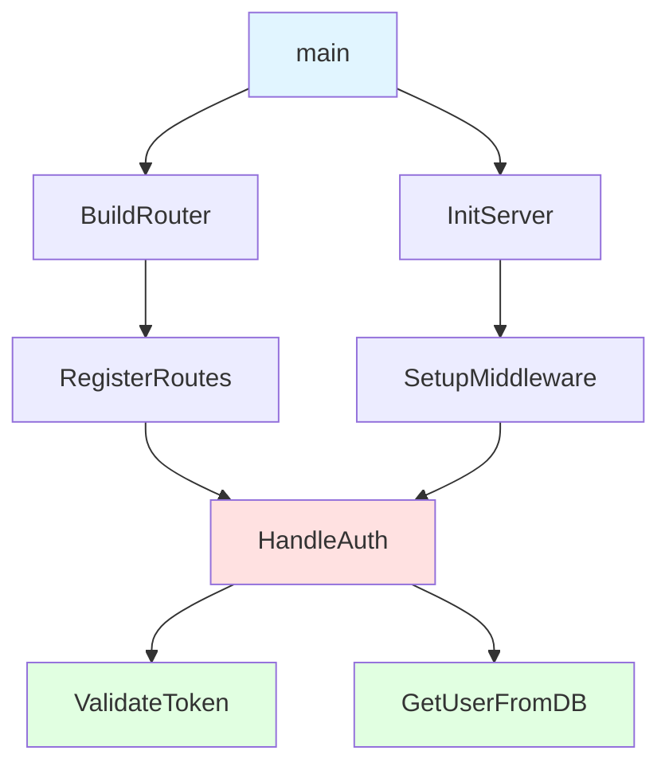

# CIE Architecture

> **Version:** 1.1
> **Last Updated:** 2026-02-06
> **Status:** Stable

---

## Overview

CIE (Code Intelligence Engine) is an embedded-first code indexing system that provides semantic search, call graph analysis, and architectural understanding through the Model Context Protocol (MCP). CIE runs entirely on your machine with no external services required -- the MCP server opens a local CozoDB database directly and serves queries over stdin/stdout. For enterprise and distributed setups, an optional remote mode connects to an HTTP Edge Cache server.

**The Problem:**
Traditional code search relies on text matching (grep, ripgrep) which misses semantic relationships. AI assistants need to understand not just what code says, but how components interact, what functions call each other, and where features are implemented.

**CIE's Approach:**
- **Parse** source code into abstract syntax trees (ASTs) using Tree-sitter
- **Extract** functions, types, and call relationships
- **Generate** semantic embeddings for meaning-based search
- **Store** in a graph database (CozoDB with RocksDB backend) with Datalog queries
- **Serve** through MCP protocol for AI assistant integration (embedded by default)

**Key Technologies:**
- **Tree-sitter** - Error-tolerant parsing for Go, Python, JavaScript, TypeScript
- **CozoDB** - Graph database with Datalog query language and native HNSW vector indexing
- **Model Context Protocol (MCP)** - Standard protocol for AI tool integration
- **Embeddings** - Semantic vectors for similarity search (Ollama, OpenAI, Nomic)

---

## High-Level Design

CIE follows a classic ETL (Extract, Transform, Load) pipeline architecture with a query layer on top:

```
┌─────────────────────────────────────────────────────────────────┐
│                        CIE ARCHITECTURE                         │
└─────────────────────────────────────────────────────────────────┘

  ┌──────────────┐
  │   Git Repo   │
  │  or Local    │
  │  Directory   │
  └──────┬───────┘
         │
         ▼
  ┌──────────────┐
  │  Stage 1:    │  Discover files, read content
  │  RepoLoader  │  (.go, .py, .js, .ts, .proto)
  └──────┬───────┘
         │
         ▼
  ┌──────────────┐
  │  Stage 2:    │  Parse AST with Tree-sitter
  │  Parser      │  Extract functions, types, calls
  └──────┬───────┘
         │
         ▼
  ┌──────────────┐
  │  Stage 3:    │  Resolve cross-package calls
  │ CallResolver │  Build import index
  └──────┬───────┘
         │
         ▼
  ┌──────────────┐
  │  Stage 4:    │  Generate embeddings
  │  Embedding   │  Concurrent workers (Ollama/OpenAI)
  │  Generator   │
  └──────┬───────┘
         │
         ▼
  ┌──────────────────────────────────────────────────────────────┐
  │  Stage 5: Storage (CozoDB)                                   │
  │  ┌────────────┐  ┌────────────┐  ┌────────────┐             │
  │  │ Metadata   │  │    Code    │  │ Embeddings │             │
  │  │  Tables    │  │  Tables    │  │   Tables   │             │
  │  │(functions, │  │ (lazy load)│  │ (HNSW idx) │             │
  │  │  types,    │  │            │  │            │             │
  │  │  calls)    │  │            │  │            │             │
  │  └────────────┘  └────────────┘  └────────────┘             │
  └──────────────────────────────────────────────────────────────┘
         │
         ▼
  ┌──────────────────────────────────────────────────────────────┐
  │          QUERY LAYER (20+ MCP Tools)                         │
  │  ┌──────────┐ ┌──────────┐ ┌──────────┐ ┌──────────┐        │
  │  │ Semantic │ │   Call   │ │   HTTP   │ │  gRPC    │        │
  │  │  Search  │ │  Graph   │ │ Endpoint │ │ Service  │        │
  │  │          │ │  Trace   │ │ Discovery│ │Discovery │        │
  │  └──────────┘ └──────────┘ └──────────┘ └──────────┘        │
  └──────────────────────────────────────────────────────────────┘
         │
         ▼
  ┌──────────────┐
  │ MCP Server   │  JSON-RPC 2.0 over stdin/stdout
  │ (JSON-RPC)   │  Integrates with Claude Code, Cursor
  └──────────────┘
```

**Data Flow:**
1. **Ingestion** (top → down): Source code flows through 5 stages to produce indexed data
2. **Query** (bottom → up): MCP clients send queries, tools execute Datalog/HNSW searches, return results
3. **Incremental Updates**: Checkpoint system allows re-indexing only changed files

---

## Indexing Pipeline

The indexing pipeline processes source code in 5 distinct stages, each handling a specific transformation.



### Stage 1: File Discovery (RepoLoader)

**Purpose:** Locate all source files to be indexed

**Implementation:** `pkg/ingestion/repo_loader.go`

**Process:**
1. Accept git URL or local directory path
2. Clone git repositories (if URL provided) with security validation
3. Walk directory tree, filter by language extensions
4. Apply exclude patterns from configuration (e.g., `node_modules/`, `vendor/`)
5. Collect file metadata: path, size, language, hash

**Key Features:**
- Supports `.gitignore`-style exclude patterns
- Language detection by file extension (.go, .py, .js, .ts, .proto)
- File hash tracking for incremental indexing

**Configuration:**
```yaml
# .cie/project.yaml
indexing:
  exclude:
    - "**/node_modules/**"
    - "**/vendor/**"
    - "**/*.test.go"
```

### Stage 2: Parsing (TreeSitterParser)

**Purpose:** Extract structured information from source code

**Implementation:**
- Factory: `pkg/ingestion/parser_treesitter.go`
- Go parser: `pkg/ingestion/parser_go.go` (reference implementation)
- Python: `pkg/ingestion/parser_python.go`
- TypeScript: `pkg/ingestion/parser_typescript.go`
- JavaScript: `pkg/ingestion/parser_javascript.go`

**Why Tree-sitter?**
- **Error-tolerant:** Parses incomplete or invalid code (crucial for in-progress files)
- **Language-agnostic:** Same API for all languages
- **Fast:** Incremental parsing for large files
- **Maintained:** Active community with 50+ language grammars

**Extraction Process (Go Example):**

```go
// pkg/ingestion/parser_go.go

// 1. Parse file to AST
tree := parser.Parse(sourceCode)

// 2. Query for functions
functionQuery := `(function_declaration name: (identifier) @func_name)`
matches := tree.Query(functionQuery)

// 3. Extract metadata for each function
for match := range matches {
    function := Function{
        ID:   deterministicID(filePath, name, range),  // Stable across runs
        Name: extractName(match),
        Signature: extractSignature(match),
        Code: extractCode(match),
        StartLine: match.StartPosition.Row,
        EndLine: match.EndPosition.Row,
    }

    // 4. Extract calls within function body
    calls := extractCalls(match.Node)
    for call := range calls {
        callEdge := Call{
            Caller: function.ID,
            Callee: call.Name,  // May be unresolved (handled in Stage 3)
        }
    }
}
```

**What Gets Extracted:**

| Language   | Functions | Methods | Types | Interfaces | Calls | Imports |
|------------|-----------|---------|-------|------------|-------|---------|
| Go         | Yes        | Yes      | Yes    | Yes         | Yes    | Yes      |
| Python     | Yes        | Yes      | Yes    | Yes         | Yes    | Yes      |
| TypeScript | Yes        | Yes      | Yes    | Yes         | Yes    | Yes      |
| JavaScript | Yes        | Yes      | Yes    | Yes         | Yes    | Yes      |

**Deterministic IDs:**

A critical design choice is deterministic ID generation (`pkg/ingestion/schema.go:59`):

```go
func FunctionID(filePath, name string, startLine, endLine int) string {
    return fmt.Sprintf("%x", sha256.Sum256([]byte(
        fmt.Sprintf("%s:%s:%d-%d", filePath, name, startLine, endLine),
    )))
}
```

**Why Deterministic IDs Matter:**
- **Idempotent re-indexing:** Same code → same IDs → update in place
- **Incremental updates:** Detect which functions changed by comparing IDs
- **Stable references:** External tools can reference functions by ID

### Stage 3: Call Resolution (CallResolver)

**Purpose:** Map function calls to their definitions across package boundaries

**Implementation:** `pkg/ingestion/resolver.go`

**The Problem:**

After Stage 2, we have call edges like:
```
HandleAuth() calls ValidateToken()
```

But which `ValidateToken()`? There might be multiple:
- `auth.ValidateToken()` in package `auth`
- `jwt.ValidateToken()` in package `jwt`
- Local `ValidateToken()` in same file

**The Solution:**

Build an import index and resolve qualified names:

1. **Build Import Index:**
   ```go
   // For each file, map package aliases to full paths
   imports := map[string]string{
       "auth": "github.com/org/repo/internal/auth",
       "jwt":  "github.com/org/repo/pkg/jwt",
   }
   ```

2. **Resolve Calls:**
   ```go
   // Unresolved call: "auth.ValidateToken"
   packagePath := imports["auth"]  // → "github.com/org/repo/internal/auth"
   functionName := "ValidateToken"

   // Look up function ID in index
   functionID := index.FindFunction(packagePath, functionName)

   // Update call edge with resolved callee ID
   callEdge.Callee = functionID
   ```

3. **Handle Go Receiver Syntax:**
   ```go
   // Call: "batcher.Batch()" where batcher is *Batcher
   // Resolve to method: "Batcher.Batch"
   ```

**Unresolved Calls:**

Some calls can't be resolved (external libraries, dynamic calls):
```go
// External: http.ListenAndServe (stdlib, not in index)
// Dynamic: functionMap[name]()
```

These are marked as unresolved but still stored for reference.

### Stage 4: Embedding Generation (EmbeddingGenerator)

**Purpose:** Generate semantic vectors for similarity search

**Implementation:** `pkg/ingestion/embedding.go`

**Process:**

1. **Concurrent Generation:**
   ```go
   // Default: 8 workers
   workers := 8
   workQueue := make(chan Function, 1000)

   // Worker pool
   for i := 0; i < workers; i++ {
       go func() {
           for fn := range workQueue {
               embedding := provider.Generate(fn.Code)
               fn.Embedding = normalize(embedding)  // L2 norm = 1.0
               store(fn)
           }
       }()
   }
   ```

2. **Provider Auto-Detection:**
   ```go
   // pkg/llm/provider.go

   // Detect from environment variables
   if os.Getenv("OLLAMA_HOST") != "" {
       return NewOllamaProvider()  // Default: nomic-embed-text
   }
   if os.Getenv("OPENAI_API_KEY") != "" {
       return NewOpenAIProvider()  // text-embedding-3-small
   }
   if os.Getenv("NOMIC_API_KEY") != "" {
       return NewNomicProvider()
   }
   return NewMockProvider()  // Testing only
   ```

3. **Retry Logic:**
   ```go
   maxRetries := 3
   backoff := 1 * time.Second

   for attempt := 0; attempt < maxRetries; attempt++ {
       embedding, err := provider.Generate(text)
       if err == nil {
           return embedding
       }
       time.Sleep(backoff * time.Duration(1 << attempt))  // Exponential backoff
   }
   ```

**Vector Normalization:**

All embeddings are L2-normalized (unit vectors):
```go
// Ensures dot product equals cosine similarity
length := math.Sqrt(sum(v[i]² for i in range(len(v))))
normalized := [v[i]/length for i in range(len(v))]
```

**Why Normalize?**
- HNSW index uses dot product (faster than cosine)
- Normalization makes dot product = cosine similarity
- Consistent similarity scores across providers

### Stage 5: Storage (LocalPipeline)

**Purpose:** Store indexed data in CozoDB

**Implementation:**
- Pipeline: `pkg/ingestion/local_pipeline.go`
- Batching: `pkg/ingestion/batcher.go`
- Schema: `pkg/ingestion/schema.go`

**Process:**

1. **Generate Datalog Mutations:**
   ```datalog
   ?[id, name, file_path, signature, start_line, end_line, language] <- [
       ["abc123", "HandleAuth", "internal/auth/handler.go", "func HandleAuth(ctx context.Context) error", 42, 65, "go"],
       ["def456", "ValidateToken", "internal/auth/token.go", "func ValidateToken(token string) bool", 15, 25, "go"]
   ]
   :put cie_function {id, name, file_path, signature, start_line, end_line, language}
   ```

2. **Batch Large Writes:**
   ```go
   // CozoDB limits: ~1000 mutations or ~2MB per transaction
   // pkg/ingestion/batcher.go

   const maxMutationsPerBatch = 1000
   const maxBytesPerBatch = 2 * 1024 * 1024  // 2MB

   for len(mutations) > 0 {
       batch := takeBatch(mutations, maxMutationsPerBatch, maxBytesPerBatch)
       db.Run(batch)  // Execute transaction
   }
   ```

3. **Checkpoint Progress:**
   ```go
   // Store checkpoint after each file
   checkpoint := Checkpoint{
       FilePath: file.Path,
       FileHash: file.Hash,
       Indexed: true,
   }
   db.Run(`?[file_path, file_hash] <- [["${file.Path}", "${file.Hash}"]] :put cie_checkpoint {file_path, file_hash}`)
   ```

**Incremental Indexing:**

On subsequent runs:
1. Load checkpoint: which files were indexed, their hashes
2. Compare current file hashes to checkpoint
3. Skip files with matching hashes (unchanged)
4. Re-index only changed/new files
5. Update checkpoint

**Why This Matters:**
- Initial index of 100k LOC: ~2 minutes
- Incremental update (10 changed files): ~5 seconds
- 40x speedup for typical development workflow

---

## Storage Layer

CIE uses CozoDB, an embedded graph database with native support for Datalog queries and vector similarity search.

```
┌─────────────────────────────────────────────────────────┐
│                   CIE COMPONENTS                        │
└─────────────────────────────────────────────────────────┘

  ┌──────────────┐
  │  Ingestion   │
  │   Pipeline   │
  │   (5 stages) │
  └──────┬───────┘
         │ writes (batch 1000)
         ▼
  ┌──────────────────────────────────────┐
  │         CozoDB Storage               │
  │  ┌──────────┐  ┌──────────────────┐ │
  │  │ Metadata │  │  Code + Embeddings│ │
  │  │  Tables  │  │   (lazy loaded)   │ │
  │  └──────────┘  └──────────────────┘ │
  └─────┬────────────────────────────────┘
        │ reads (Datalog queries)
        ▼
  ┌──────────────┐         ┌──────────────┐
  │  Query Tools │────────►│ LLM Provider │
  │   (20+ MCP)  │ calls   │ (if analyze) │
  └──────┬───────┘         └──────────────┘
         │ returns
         ▼
  ┌──────────────┐
  │  MCP Server  │
  │  (JSON-RPC)  │
  └──────────────┘
```

### CozoDB Integration

**Implementation:** `pkg/cozodb/cozodb.go`

**Why CozoDB?**

| Feature | Why It Matters |
|---------|---------------|
| **Datalog Query Language** | Perfect for graph queries (call graphs, type hierarchies) |
| **HNSW Vector Index** | Native semantic search, no separate vector DB needed |
| **Embedded** | No external service, data stays local |
| **ACID Transactions** | Consistent updates during incremental indexing |
| **Multiple Backends** | Memory (testing), SQLite (small projects), RocksDB (large projects) |

**Database Modes:**

```go
// pkg/cozodb/cozodb.go:42-88

// In-memory (testing, temporary index)
db := NewDB("mem", "")

// SQLite (small projects, <10k functions)
db := NewDB("sqlite", ".cie/index.db")

// RocksDB (large projects, production — default for MCP server embedded mode)
db := NewDB("rocksdb", ".cie/index_rocksdb")
```

> **Note:** The MCP server uses RocksDB by default when running in embedded mode. Data is stored at `~/.cie/data/<project>/`. The `mem` backend is used only in tests, and `sqlite` is available for lightweight use cases but is not the default.

**Read-Only vs Write:**

```go
// Write operations (indexing)
db.Run(`?[...] <- [...] :put cie_function {...}`)

// Read-only queries (safe for concurrent access)
db.RunReadOnly(`?[name, file_path] := *cie_function { name, file_path }`)
```

### Schema Design (v3)

**Implementation:** `pkg/ingestion/schema.go:24-35`

**Key Principle: Vertical Partitioning**

```
VERTICAL PARTITIONING STRATEGY
━━━━━━━━━━━━━━━━━━━━━━━━━━━━━━━━━━━━━━━━━━━━━━━━━━━━━━━

Instead of:
┌─────────────────────────────────────────────────┐
│ cie_function (wide table, ~5.5KB/row)          │
│ ┌─────┬──────┬────────┬───────┬────────┬─────┐ │
│ │ id  │ name │  sig   │ code  │ embed  │ ... │ │
│ └─────┴──────┴────────┴───────┴────────┴─────┘ │
└─────────────────────────────────────────────────┘
No Problem: Load 5KB even when only need name

We use:
┌──────────────────────────┐
│ cie_function (~500 bytes)│  ← Fast queries
│ ┌─────┬──────┬────────┐  │
│ │ id  │ name │  sig   │  │
│ └─────┴──────┴────────┘  │
└──────────────────────────┘
          ║
          ║ 1:1 joins (lazy)
          ║
    ┌─────╩──────┐     ┌──────────────────┐
    │            │     │                  │
┌───▼──────────┐ │ ┌───▼────────────────┐ │
│ cie_function │ │ │ cie_function       │ │
│ _code        │ │ │ _embedding         │ │
│ (~2KB)       │ │ │ (~3KB, HNSW idx)   │ │
└──────────────┘ │ └────────────────────┘ │
  Load when user   │   Load for semantic   │
  requests code    │   search only         │
```

Instead of storing everything in one table:
```
No cie_function(id, name, file_path, signature, code, embedding)
   Problem: Large rows, slow queries when we only need metadata
```

We split into three tables per entity:
```
Yes cie_function(id, name, file_path, signature, start_line, end_line, language)  // Lightweight ~500 bytes
Yes cie_function_code(id, code)                                                   // Lazy loaded
Yes cie_function_embedding(id, embedding)                                         // For HNSW only
```

**Full Schema:**

```datalog
# Core Entities
:create cie_file {
    id: String,           # File hash
    path: String,         # Relative path
    hash: String,         # Content hash (for incremental)
    language: String,     # go, python, typescript, javascript
    size: Int,            # Bytes
    indexed_at: Int       # Unix timestamp
}

:create cie_function {
    id: String,           # Deterministic: hash(path + name + range)
    name: String,         # Function name
    file_path: String,    # Where it's defined
    signature: String,    # Full signature
    start_line: Int,      # Start line number
    end_line: Int,        # End line number
    language: String,     # Language
    role: String          # entry_point, router, handler, source, test, generated
}

:create cie_function_code {
    id: String,           # Same as cie_function.id
    code: String          # Full function source code
}

:create cie_function_embedding {
    id: String,           # Same as cie_function.id
    embedding: [F32; 768] # Vector (dimension depends on provider)
}

:create cie_type {
    id: String,
    name: String,
    file_path: String,
    kind: String,         # struct, interface, class, type_alias
    signature: String,
    start_line: Int,
    end_line: Int,
    language: String
}

:create cie_type_code {
    id: String,
    code: String
}

:create cie_type_embedding {
    id: String,
    embedding: [F32; 768]
}

# Relationships (Edges)
:create cie_defines {
    file_id: String,      # cie_file.id
    function_id: String   # cie_function.id
}

:create cie_defines_type {
    file_id: String,
    type_id: String
}

:create cie_calls {
    caller_id: String,    # cie_function.id
    callee_id: String,    # cie_function.id
    line_number: Int      # Where call appears
}

:create cie_import {
    file_id: String,
    package_path: String,
    alias: String         # Import alias (empty if none)
}

# Indexes
::hnsw create cie_function_embedding:embedding {
    dim: 768,
    m: 16,
    ef_construction: 200,
    distance: Cosine,
    extend_candidates: true,
    keep_pruned_connections: true
}

::hnsw create cie_type_embedding:embedding {
    dim: 768,
    m: 16,
    ef_construction: 200,
    distance: Cosine
}
```

**Why This Schema?**

1. **Fast Metadata Queries:**
   ```datalog
   # Get all functions in a file (no need to load code/embeddings)
   ?[name, signature] := *cie_function {
       name,
       signature,
       file_path: "internal/auth/handler.go"
   }
   ```

2. **Lazy Loading:**
   ```datalog
   # Load code only when needed (e.g., "Get Function Code" tool)
   ?[code] := *cie_function_code { id: $func_id, code }
   ```

3. **HNSW Efficiency:**
   - HNSW index only on embedding tables (smaller, faster)
   - Metadata queries don't touch embedding storage
   - Post-filter results using metadata tables

4. **Storage Optimization:**
   - Functions without embeddings: only metadata stored
   - Large functions: code compressed separately
   - Embeddings: float32 arrays, optimized for HNSW

**Storage Sizes (Typical Go Project):**

| Component | Size per Function | 10k Functions |
|-----------|-------------------|---------------|
| Metadata (cie_function) | ~500 bytes | ~5MB |
| Code (cie_function_code) | ~2KB | ~20MB |
| Embedding (cie_function_embedding) | ~3KB (768 dims × 4 bytes) | ~30MB |
| **Total** | **~5.5KB** | **~55MB** |

### Example Datalog Queries

**Find all functions in a package:**
```datalog
?[name, file_path, start_line] := *cie_function {
    name,
    file_path,
    start_line,
    file_path ~ "^internal/auth/.*"  # Regex match
}
```

**Get call graph for a function:**
```datalog
# Direct callees
?[callee_name, callee_file] :=
    *cie_function { id: $func_id },
    *cie_calls { caller_id: $func_id, callee_id },
    *cie_function { id: callee_id, name: callee_name, file_path: callee_file }

# Transitive closure (all reachable functions)
reachable[callee_id] := *cie_calls { caller_id: $func_id, callee_id }
reachable[next_callee] := reachable[callee_id], *cie_calls { caller_id: callee_id, callee_id: next_callee }
?[name, file_path] := reachable[fid], *cie_function { id: fid, name, file_path }
```

**Semantic search with post-filtering:**
```datalog
# HNSW kNN search
candidates[id, score] := ~cie_function_embedding:embedding {
    query: $embedding_vector,
    k: 100,                    # Over-fetch for post-filtering
    ef: 200,                   # Search quality
    | id, score
}

# Post-filter by file path pattern
?[name, file_path, score] :=
    candidates[id, score],
    *cie_function {
        id,
        name,
        file_path,
        file_path ~ "^internal/.*",  # Only internal packages
        role: "source"                # Exclude tests/generated
    }

# Sort by score, limit results
:limit 10
:sort -score
```

---

## Query Execution

The query layer provides 20+ MCP tools organized by function. All tools query the CozoDB index using Datalog and return structured results.



### Tool Architecture

**Implementation:** `pkg/tools/`

**Querier Interface (Dual-Mode):**

All tools query through the `Querier` interface, which abstracts over both embedded and remote modes:

```go
// pkg/tools/client.go

// Querier is the interface for both embedded and remote modes.
// All 20+ tools call Querier methods rather than a specific backend.
type Querier interface {
    Query(ctx context.Context, script string) (*QueryResult, error)
    QueryRaw(ctx context.Context, script string) (map[string]any, error)
}

// EmbeddedQuerier — reads directly from local CozoDB (default)
// pkg/tools/client_embedded.go
type EmbeddedQuerier struct {
    backend *storage.EmbeddedBackend
}

// CIEClient — HTTP client for remote Edge Cache servers
// pkg/tools/client.go
type CIEClient struct {
    BaseURL    string       // CIE Edge Cache API URL
    HTTPClient *http.Client // 90-second timeout for large queries
}
```

In embedded mode (the default), the MCP server opens a local CozoDB database at `~/.cie/data/<project>/` and wraps it in an `EmbeddedQuerier`. In remote mode, a `CIEClient` sends HTTP requests to an Edge Cache server. The tool layer is unaware of which mode is active -- it only calls `Querier` methods.

### Tool Categories

#### Search Tools

**Semantic Search** (`pkg/tools/semantic.go`)

The flagship tool for meaning-based code search.



**Process:**
1. **Generate Query Embedding:**
   ```go
   queryEmbedding := embeddingProvider.Generate(query)
   ```

2. **HNSW kNN Search:**
   ```datalog
   candidates[id, score] := ~cie_function_embedding:embedding {
       query: $query_embedding,
       k: $limit * 10,  # Over-fetch for post-filtering
       ef: 200,
       | id, score
   }
   ```

3. **Keyword Boosting** (`semantic.go:47-64`):
   ```go
   // Extract keywords from query
   keywords := strings.Fields(strings.ToLower(query))

   // Boost functions where name contains keywords
   for each function in candidates:
       for keyword in keywords:
           if strings.Contains(strings.ToLower(function.Name), keyword):
               function.Score += 0.15  // +15% boost
   ```

4. **Post-Filtering:**
   ```datalog
   # Apply filters
   ?[name, file_path, score] :=
       candidates[id, score],
       *cie_function {
           id,
           name,
           file_path,
           file_path ~ $path_pattern,  # Optional regex filter
           role: $role                  # source, test, generated, entry_point, router, handler
       },
       score >= $min_similarity  # Threshold filter (e.g., 0.7 = 70% similar)

   :sort -score
   :limit $limit
   ```

**Why Keyword Boosting?**
- Functions named `HandleAuth` are very likely relevant to query "authentication"
- Pure semantic search might rank generic "validate user" higher
- Boosting ensures exact name matches rank at the top

**Grep** (`pkg/tools/grep.go`)

Ultra-fast literal text search (no regex):
```go
// Search function code, signatures, or names
func Grep(text string, searchIn string) []Match {
    script := `?[name, file_path, line, code] :=
        *cie_function { name, file_path, start_line: line },
        *cie_function_code { id: $id, code },
        code ~ $text`  # Case-insensitive substring match
    return db.Query(script)
}
```

**Search Text** (`pkg/tools/search.go`)

Regex pattern search:
```go
func SearchText(pattern string, literal bool) []Match {
    if literal {
        return Grep(pattern, "all")  // Faster path
    }
    // Regex search (slower but more powerful)
    script := `?[...] := *cie_function {...}, code ~ $regex_pattern`
    return db.Query(script)
}
```

#### Navigation Tools

**Find Function** (`pkg/tools/code.go`)

```go
func FindFunction(name string, exactMatch bool) []Function {
    if exactMatch {
        script := `?[...] := *cie_function { name: $name, ... }`
    } else {
        // Partial match (e.g., "Batch" finds "Batcher.Batch")
        script := `?[...] := *cie_function { name, ... }, name ~ $name`
    }
    return db.Query(script)
}
```

**Get Function Code** (`pkg/tools/code.go`)

```go
func GetFunctionCode(name string, fullCode bool) string {
    // Find function ID
    funcID := FindFunction(name)[0].ID

    // Lazy load code
    script := `?[code] := *cie_function_code { id: $funcID, code }`
    code := db.Query(script)[0].Code

    if !fullCode && len(code) > 5000 {
        return code[:5000] + "\n... (truncated, use full_code=true)"
    }
    return code
}
```

**Find Callers** (`pkg/tools/search.go`)

```go
func FindCallers(functionName string) []Function {
    // 1. Find function ID
    targetID := FindFunction(functionName)[0].ID

    // 2. Query call graph
    script := `?[caller_name, caller_file, line] :=
        *cie_calls { caller_id, callee_id: $targetID, line_number: line },
        *cie_function { id: caller_id, name: caller_name, file_path: caller_file }`

    return db.Query(script)
}
```

**Find Callees** (`pkg/tools/search.go`)

```go
func FindCallees(functionName string) []Function {
    targetID := FindFunction(functionName)[0].ID
    script := `?[callee_name, callee_file] :=
        *cie_calls { caller_id: $targetID, callee_id },
        *cie_function { id: callee_id, name: callee_name, file_path: callee_file }`
    return db.Query(script)
}
```

#### Analysis Tools

**Trace Path** (`pkg/tools/trace.go`)

Finds call paths from entry points to a target function.

**Process:**
1. **Identify Entry Points** (if source not specified):
   ```datalog
   # Auto-detect by language conventions
   # Go: func main(), func init()
   # Python: if __name__ == "__main__"
   # JavaScript/TypeScript: exported functions in index.ts

   ?[id, name] := *cie_function {
       id,
       name,
       role: "entry_point"
   }
   ```

2. **Build Transitive Closure** (all reachable functions from source):
   ```datalog
   # Direct calls
   reachable[callee_id, 1] := *cie_calls { caller_id: $source_id, callee_id }

   # Transitive calls
   reachable[next_callee, depth + 1] :=
       reachable[callee_id, depth],
       *cie_calls { caller_id: callee_id, callee_id: next_callee },
       depth < $max_depth

   # Check if target is reachable
   path_exists := reachable[$target_id, _]
   ```

3. **Extract Shortest Paths:**
   ```datalog
   # Backtrack from target to source
   ?[caller_name, callee_name, depth] :=
       reachable[callee_id, depth],
       *cie_calls { caller_id, callee_id },
       *cie_function { id: caller_id, name: caller_name },
       *cie_function { id: callee_id, name: callee_name }

   :sort depth
   :limit $max_paths
   ```



**Example Output:**
```
Path 1: main → BuildRouter → RegisterRoutes → HandleAuth (depth: 3)
Path 2: main → InitServer → SetupMiddleware → HandleAuth (depth: 3)
```

**Analyze** (`pkg/tools/analyze.go`)

Architectural questions answered with LLM narratives.

**Process:**
1. **Hybrid Search:**
   ```go
   // Localized search (query-based)
   localResults := SemanticSearch(query, limit: 10, minSimilarity: 0.6)

   // Global search (project-wide context)
   globalResults := SemanticSearch(query, limit: 5, minSimilarity: 0.5, pathPattern: "")

   // Combine
   results := append(localResults, globalResults...)
   ```

2. **Build Context:**
   ```go
   context := "Project: " + projectID + "\n\n"
   context += "Query: " + query + "\n\n"
   context += "Relevant Functions:\n"
   for result := range results {
       code := GetFunctionCode(result.Name, fullCode: false)
       context += fmt.Sprintf("- %s (%s:%d)\n%s\n\n",
           result.Name, result.FilePath, result.StartLine, code)
   }
   ```

3. **LLM Generation:**
   ```go
   prompt := `You are a code architecture expert. Answer this question about the codebase:

   Question: ` + query + `

   Context:
   ` + context + `

   Provide a clear, concise answer with code references.`

   response := llmProvider.Generate(prompt, maxTokens: 2000)
   return response
   ```

**Example:**
```
Query: "How does the replication log work?"

Answer: The replication log is implemented in `pkg/primaryhub/replication.go:45-120`
using a sequential log structure. When a write operation occurs via ExecuteWrite(),
the Primary Hub:

1. Appends the mutation to the log (AppendToLog() at line 67)
2. Assigns a monotonic sequence number
3. Notifies Edge Caches via gRPC streaming (StreamReplicationLog() at line 89)

Edge Caches consume the log via MountProject() for initial sync, then
StreamReplicationLog() for incremental updates. See `pkg/edgecache/replication.go:120`
for the consumer implementation.
```

#### Discovery Tools

**List Endpoints** (`pkg/tools/endpoints.go`)

Discovers HTTP/REST endpoints from Go code.

**Pattern Detection:**
```go
// Gin framework
router.GET("/api/users", HandleUsers)

// Echo framework
e.POST("/api/login", HandleLogin)

// Chi framework
r.Route("/api", func(r chi.Router) {
    r.Get("/health", HandleHealth)
})

// Fiber framework
app.Get("/api/status", HandleStatus)

// net/http
http.HandleFunc("/api/metrics", HandleMetrics)
```

**Process:**
1. Search for route registration patterns:
   ```go
   patterns := []string{
       `\.GET\(`,      // Gin, Echo
       `\.POST\(`,
       `r\.Get\(`,     // Chi
       `app\.Get\(`,   // Fiber
       `HandleFunc\(`, // net/http
   }

   for pattern := range patterns {
       matches := Grep(pattern, "code")
       for match := range matches {
           endpoint := parseEndpoint(match.Code)
           endpoints = append(endpoints, endpoint)
       }
   }
   ```

2. Extract method, path, handler:
   ```go
   // Example: router.GET("/api/users/:id", HandleGetUser)
   endpoint := Endpoint{
       Method:  "GET",
       Path:    "/api/users/:id",
       Handler: "HandleGetUser",
       File:    "internal/http/users.go",
       Line:    42,
   }
   ```

**Output:**
```
| Method | Path               | Handler          | File                        |
|--------|--------------------|------------------|-----------------------------|
| GET    | /api/health        | HandleHealth     | internal/http/health.go:15  |
| GET    | /api/users         | HandleListUsers  | internal/http/users.go:23   |
| GET    | /api/users/:id     | HandleGetUser    | internal/http/users.go:42   |
| POST   | /api/users         | HandleCreateUser | internal/http/users.go:67   |
| DELETE | /api/users/:id     | HandleDeleteUser | internal/http/users.go:89   |
```

**List Services** (`pkg/tools/services.go`)

Discovers gRPC services from .proto files.

```proto
// Example: api/proto/users.proto
service UserService {
  rpc GetUser(GetUserRequest) returns (GetUserResponse);
  rpc ListUsers(ListUsersRequest) returns (ListUsersResponse);
  rpc CreateUser(CreateUserRequest) returns (CreateUserResponse);
}
```

**Output:**
```
Service: UserService (api/proto/users.proto:10)
  - GetUser(GetUserRequest) → GetUserResponse
  - ListUsers(ListUsersRequest) → ListUsersResponse
  - CreateUser(CreateUserRequest) → CreateUserResponse
```

**Index Status** (`pkg/tools/status.go`)

Health check for the index:
```go
func IndexStatus(pathPattern string) Status {
    stats := db.Query(`
        file_count[] := count(id), *cie_file { id }
        function_count[] := count(id), *cie_function { id }
        type_count[] := count(id), *cie_type { id }
        call_count[] := count(*), *cie_calls { }

        ?[file_count, function_count, type_count, call_count] :=
            file_count[fc],
            function_count[fnc],
            type_count[tc],
            call_count[cc]
    `)

    return Status{
        Files: stats.FileCount,
        Functions: stats.FunctionCount,
        Types: stats.TypeCount,
        Calls: stats.CallCount,
        Coverage: calculateCoverage(pathPattern),
    }
}
```

---

## MCP Server

The MCP (Model Context Protocol) server exposes CIE tools to AI assistants via JSON-RPC 2.0.

**Implementation:** `cmd/cie/mcp.go`

```
┌──────────────────────────────────────────────────────┐
│               MCP Protocol (JSON-RPC 2.0)            │
│                    stdin/stdout                       │
└─────────────────────┬────────────────────────────────┘
                      │
         ┌────────────┴────────────┐
         │                         │
    ┌────▼────┐              ┌─────▼─────┐
    │  Claude │              │  Cursor   │
    │   Code  │              │   IDE     │
    └────┬────┘              └─────┬─────┘
         │                         │
         └────────────┬────────────┘
                      │
                      ▼
         ┌────────────────────────┐
         │   CIE MCP Server       │
         │  (cmd/cie/mcp.go)      │
         │                        │
         │  Mode: embedded (default)
         │  or remote (edge_cache) │
         └────────────┬───────────┘
                      │
         ┌────────────┴────────────┐
         │                         │
    ┌────▼─────┐            ┌──────▼──────┐
    │  20+     │            │   CozoDB    │
    │  Tools   │───────────►│  (embedded) │
    │  Layer   │  Querier   │  ~/.cie/data│
    └──────────┘  interface └─────────────┘
```

### JSON-RPC 2.0 Protocol

**Transport:** stdin/stdout (stdio transport)

**Message Format:**
```json
{
  "jsonrpc": "2.0",
  "id": 1,
  "method": "tools/call",
  "params": {
    "name": "cie_semantic_search",
    "arguments": {
      "query": "authentication middleware",
      "limit": 10
    }
  }
}
```

**Response:**
```json
{
  "jsonrpc": "2.0",
  "id": 1,
  "result": {
    "content": [
      {
        "type": "text",
        "text": "Found 3 results:\n\n1. AuthMiddleware (internal/http/auth.go:42)\n   Similarity: 0.89\n..."
      }
    ]
  }
}
```

### Server Lifecycle

**Implementation:** `cmd/cie/mcp.go`

**Dual-Mode Operation:**

The MCP server supports two modes, selected automatically based on project configuration:

- **Embedded (default)**: Opens local CozoDB (RocksDB backend) at `~/.cie/data/<project>/` directly. No external server needed. This is the recommended mode for individual developers.
- **Remote**: Connects to an HTTP Edge Cache server for enterprise/distributed setups.

Mode is determined by the `edge_cache` field in `.cie/project.yaml`:
- Empty or absent → **embedded mode**
- URL present → **remote mode** (with auto-fallback to embedded if the server is unreachable and local data exists)

1. **Initialization:**
   ```
   Client → initialize →
   ← Server responds with capabilities

   Client → initialized (notification) →
   Server: Opens CozoDB (embedded) or connects to Edge Cache (remote)
   Server: Ready to receive requests
   ```

2. **Tool Discovery:**
   ```
   Client → tools/list →
   ← Server: 20+ tools with JSON Schema
   ```

3. **Tool Execution:**
   ```
   Client → tools/call { name, arguments } →
   ← Server: Result or error
   ```

4. **Shutdown:**
   ```
   Client → shutdown →
   ← Server: OK

   Client closes stdin/stdout
   ```

### Tool Registration

**Implementation:** `cmd/cie/mcp.go:260-785`

Each tool is registered with:
- **Name:** `cie_semantic_search`
- **Description:** "Search code by meaning using embeddings"
- **Input Schema:** JSON Schema for validation

**Example Tool Definition:**
```go
{
    Name: "cie_semantic_search",
    Description: "Search code by meaning using vector similarity...",
    InputSchema: map[string]interface{}{
        "type": "object",
        "properties": map[string]interface{}{
            "query": map[string]interface{}{
                "type": "string",
                "description": "Natural language query",
            },
            "limit": map[string]interface{}{
                "type": "integer",
                "description": "Max results (default: 10)",
                "default": 10,
            },
            "min_similarity": map[string]interface{}{
                "type": "number",
                "description": "Min similarity (0.0-1.0)",
            },
        },
        "required": []string{"query"},
    },
}
```

### Tool Handlers

**Implementation:** `cmd/cie/mcp.go:792-816`

Tool execution dispatches to handlers:
```go
toolHandlers := map[string]func(args map[string]interface{}) (string, error){
    "cie_semantic_search": func(args map[string]interface{}) (string, error) {
        query := args["query"].(string)
        limit := args["limit"].(int)

        results, err := tools.SemanticSearch(query, limit)
        if err != nil {
            return "", err
        }

        return formatResults(results), nil
    },
    // ... 19 more tools
}
```

### Error Handling

**Implementation:** `cmd/cie/mcp.go:1101-1211`

CIE provides actionable error messages:

**Example: No Index Found (Embedded Mode)**
```
Error: No CIE index found for project "myproject"

Possible causes:
1. Project has not been indexed yet
   → Run: cie index

2. Wrong project directory
   → Check: cie config show
   → Index location: ~/.cie/data/<project>/
```

**Example: Remote Edge Cache Unreachable**
```
Warning: Edge Cache at http://192.168.1.10:30080 is not reachable.
Falling back to embedded mode.

Tip: Remove 'edge_cache' from .cie/project.yaml or run 'cie init --force -y'
to use embedded mode by default.
```

**Example: Query Timeout**
```
Error: Query timeout after 90 seconds

This usually means:
1. Query is too complex (e.g., k=2000 in HNSW search)
   → Reduce k parameter or add path filters

2. Database is large (>100k functions)
   → Use more specific path_pattern to narrow scope
```

**Example: Regex Error**
```
Error: Invalid regex pattern in path_pattern: "**/*.go"

Glob patterns are not regex. Use regex syntax:
  ✗ **/*.go (glob)
  OK .*/.*\.go (regex)

Or use exclude_pattern for simpler filtering.
```

---

## Design Decisions

### Why CozoDB?

**Decision:** Use CozoDB as the primary storage engine instead of PostgreSQL, Elasticsearch, or custom graph databases.

**Rationale:**

1. **Graph Queries Are First-Class:**
   - Call graphs, type hierarchies, import dependencies are naturally graphs
   - Datalog expresses graph traversal elegantly:
     ```datalog
     # Transitive closure in 3 lines
     reachable[callee] := *cie_calls { caller_id: $id, callee_id: callee }
     reachable[next] := reachable[callee], *cie_calls { caller_id: callee, callee_id: next }
     ```
   - SQL requires recursive CTEs (verbose, less readable)

2. **Native HNSW Vector Index:**
   - Eliminates need for separate vector database (Pinecone, Weaviate)
   - Vectors and metadata in one transactional store
   - HNSW index provides <10ms kNN queries even at 100k vectors

3. **Embedded = Zero-Setup:**
   - No server to manage, no Docker required, data stays on machine
   - Single binary opens CozoDB directly (RocksDB backend at `~/.cie/data/`)
   - RocksDB backend handles 1M+ functions

4. **Transactional Consistency:**
   - ACID guarantees during incremental indexing
   - No partial updates, no race conditions
   - Rollback on errors

**Alternatives Considered:**

| Alternative | Why Not |
|-------------|---------|
| **PostgreSQL + pgvector** | No native graph queries, recursive CTEs are verbose |
| **Neo4j** | Heavy (JVM), not embeddable, no native vector search |
| **SQLite + custom vectors** | No HNSW, kNN search is O(n) scan |
| **Elasticsearch** | Heavy, document-oriented not graph-oriented |
| **Custom graph DB** | Reinventing the wheel, high maintenance |

**Trade-offs:**

- **CGO Required:** CozoDB uses C bindings, complicates cross-compilation
  - Mitigation: Distribute pre-built binaries for major platforms
- **Less Mature:** CozoDB is younger than PostgreSQL/Neo4j
  - Mitigation: Active development, responsive maintainer, stable API
- **Learning Curve:** Datalog is unfamiliar to most developers
  - Mitigation: Comprehensive documentation, examples in codebase

### Why Tree-sitter?

**Decision:** Use Tree-sitter for parsing instead of language-specific parsers or LSP servers.

**Rationale:**

1. **Error-Tolerant Parsing:**
   - Parses incomplete code (in-progress files, syntax errors)
   - Critical for indexing real-world codebases
   - LSP servers often fail on broken code

2. **Language-Agnostic API:**
   - Same API for Go, Python, JavaScript, TypeScript
   - Add new language = add grammar, reuse extraction logic
   - Reduces code duplication (4 languages with 1 parser framework)

3. **Fast Incremental Parsing:**
   - Re-parse only changed regions of file
   - Suitable for watch mode (future feature)
   - Handles large files (10k+ lines) efficiently

4. **Query Language:**
   - S-expression queries for AST patterns
   - Example: `(function_declaration name: (identifier) @func_name)`
   - More flexible than regex, more maintainable than visitor patterns

**Alternatives Considered:**

| Alternative | Why Not |
|-------------|---------|
| **go/parser** | Go-only, separate parser for each language |
| **LSP servers** | Heavy (spawn process per file), fail on errors |
| **Regex** | Fragile, misses nested structures, unmaintainable |
| **AST visitors (e.g., go/ast)** | Language-specific, verbose boilerplate |

**Trade-offs:**

- **C Dependency:** Tree-sitter is C library, requires CGO
  - Mitigation: Same as CozoDB, distribute binaries
- **Grammar Maintenance:** Tree-sitter grammars can lag language updates
  - Mitigation: Active community, grammars updated regularly
- **Learning Curve:** Query syntax is unfamiliar
  - Mitigation: Helper functions in `parser_*.go` abstract complexity

### Why Vertical Partitioning?

**Decision:** Split function/type data into three tables (metadata, code, embedding) instead of one wide table.

**Rationale:**

1. **Metadata Queries Are Fast:**
   - Most queries only need `name`, `file_path`, `signature`
   - No need to load multi-KB code or embedding vectors
   - Example: "List all functions in file" reads ~500 bytes/function, not 5KB

2. **Lazy Loading:**
   - Code is loaded only when user explicitly requests it ("Get Function Code")
   - Embeddings are loaded only for HNSW search
   - Reduces memory footprint by 10x for typical queries

3. **HNSW Index Efficiency:**
   - HNSW index only contains embedding table (smaller, faster)
   - Metadata queries don't touch HNSW index (separate B-tree indexes)
   - Post-filtering is cheap (metadata already in L1 cache)

4. **Storage Optimization:**
   - Functions without embeddings: only metadata + code stored
   - Compression works better on homogeneous data (all-text or all-floats)

**Alternatives Considered:**

| Alternative | Why Not |
|-------------|---------|
| **Single wide table** | Slow queries (load 5KB/row when only need 500 bytes) |
| **JSON column** | Poor query performance, no index on nested fields |
| **Separate database** | Consistency issues (transaction across DBs is hard) |

**Trade-offs:**

- **Join Complexity:** Queries need to join 2-3 tables
  - Mitigation: Datalog joins are natural, not a burden
- **More Tables:** Schema is more complex (9 tables vs 3)
  - Mitigation: Schema is stable, rarely changes

### Why Embedded-First?

**Decision:** The MCP server opens a local CozoDB database directly (embedded mode) by default, with no external server or Docker container required. A remote mode is available for enterprise distributed setups.

**Rationale:**

1. **Zero Setup:** `cie index` + `cie mcp` -- no Docker, no server processes, no ports to manage
2. **Privacy:** Code never leaves machine (critical for enterprise/sensitive code)
3. **No Latency:** Queries are sub-millisecond reads from local RocksDB
4. **Offline:** Works without internet (airplanes, secure networks)
5. **Cost:** No per-query or per-user pricing
6. **Control:** User owns their data at `~/.cie/data/`, no vendor lock-in

**Alternatives Considered:**

| Alternative | Why Not |
|-------------|---------|
| **Cloud indexing** | Privacy concerns, latency, cost at scale |
| **Hybrid (local cache + cloud)** | Complexity, sync conflicts |
| **Local HTTP server (Docker)** | Extra setup friction, port conflicts, resource overhead |

**Trade-offs:**

- **Storage:** User's machine needs ~100MB for large projects
  - Mitigation: Compression, cleanup old indexes
- **Compute:** Indexing uses CPU/memory on user's machine
  - Mitigation: Incremental indexing, background processing
- **No Sharing:** Each user must index their own copy
  - Mitigation: Enterprise CIE has shared Edge Cache with remote mode

### Why Deterministic IDs?

**Decision:** Generate function IDs as `hash(file_path + name + range)` instead of sequential IDs or UUIDs.

**Rationale:**

1. **Idempotent Re-indexing:**
   - Same function → same ID across runs
   - Update in place instead of insert + delete
   - Avoids orphaned data

2. **Stable References:**
   - External tools can reference functions by ID
   - IDs survive re-indexing, refactoring

3. **Incremental Updates:**
   - Compare IDs to detect which functions changed
   - Skip unchanged functions (huge speedup)

4. **Distributed Indexing:**
   - Multiple machines can index different files, IDs don't conflict
   - (Used in enterprise Primary-Edge architecture)

**Alternatives Considered:**

| Alternative | Why Not |
|-------------|---------|
| **Sequential IDs** | Change on every re-index, not stable |
| **UUIDs** | Non-deterministic, same function gets different ID each run |
| **File path + name** | Not unique (multiple functions with same name in file) |

**Trade-offs:**

- **Hash Collisions:** Theoretically possible (SHA-256 collision)
  - Mitigation: Practically impossible, 2^128 space
- **Refactoring Breaks IDs:** Renaming function → new ID
  - Mitigation: Acceptable, function semantics changed

### Why Keyword Boosting in Semantic Search?

**Decision:** Add +15% score boost to functions whose names contain query keywords.

**Rationale:**

1. **Function Names Are Meaningful:**
   - Developers name functions descriptively
   - `HandleAuth` is more relevant to "authentication" than generic `processRequest`

2. **Pure Semantic Search Can Fail:**
   - Embeddings capture semantics, not exact words
   - Query "authentication" might rank generic "validate" functions higher
   - Keyword boost ensures exact matches rank top

3. **User Expectations:**
   - Users expect exact name matches to rank #1
   - Semantic search alone can be surprising ("where's HandleAuth?")

**Implementation:** `pkg/tools/semantic.go:47-64`

```go
keywords := strings.Fields(strings.ToLower(query))
for _, function := range results {
    nameLower := strings.ToLower(function.Name)
    for _, keyword := range keywords {
        if strings.Contains(nameLower, keyword) {
            function.Score *= 1.15  // +15% boost
            break
        }
    }
}
```

**Alternatives Considered:**

| Alternative | Why Not |
|-------------|---------|
| **Pure semantic search** | Misses exact name matches, surprising results |
| **Pure keyword search** | Misses synonyms, related concepts |
| **BM25 + semantic** | Complex, requires TF-IDF index |

**Trade-offs:**

- **Tuning Required:** 15% is empirically chosen, may need adjustment
  - Mitigation: Make configurable in future
- **English Bias:** Boosting only works for English function names
  - Mitigation: Document requirement, add warning in errors

### Why Checkpoint + Delta Indexing?

**Decision:** Store checkpoint of indexed files with hashes, re-index only changed files.

**Rationale:**

1. **Speed:** Incremental indexing is 40x faster than full re-index
   - Initial index: ~2 minutes for 100k LOC
   - Incremental: ~3 seconds for 10 changed files

2. **Developer Workflow:** Code changes are incremental
   - Typical commit: 5-10 files modified
   - Full re-index is wasteful (90% of files unchanged)

3. **Background Indexing:** Fast enough to run on every save (future feature)

**Implementation:** `pkg/ingestion/doc.go:158-169`

```go
// Load checkpoint
checkpoint := loadCheckpoint()  // map[filePath]hash

// Compare hashes
for file := range files {
    currentHash := sha256(file.Content)
    if checkpoint[file.Path] == currentHash {
        skip(file)  // Unchanged, skip re-indexing
    } else {
        index(file)  // Changed or new, re-index
        checkpoint[file.Path] = currentHash
    }
}

// Save updated checkpoint
saveCheckpoint(checkpoint)
```

**Alternatives Considered:**

| Alternative | Why Not |
|-------------|---------|
| **Always full re-index** | Slow (minutes), bad UX |
| **Timestamp-based** | Unreliable (file touch, git checkout changes mtimes) |
| **Git integration** | Complex, doesn't work for non-git projects |

**Trade-offs:**

- **Hash Computation:** Requires reading entire file to hash
  - Mitigation: Still faster than parsing + embedding generation
- **Checkpoint Storage:** Adds ~1KB per file to index
  - Mitigation: Negligible compared to embeddings (3KB/function)

### Why JSON-RPC for MCP?

**Decision:** Use JSON-RPC 2.0 over stdin/stdout for MCP protocol.

**Rationale:**

1. **MCP Standard:** Model Context Protocol specifies JSON-RPC 2.0
2. **Simple:** Request/response pairs, no connection management
3. **Stdio Transport:** Works everywhere (no network permissions needed)
4. **Tool-Friendly:** AI assistants (Claude Code, Cursor) support JSON-RPC natively

**Alternatives Considered:**

| Alternative | Why Not |
|-------------|---------|
| **REST API** | Requires HTTP server, port conflicts, network permissions -- contradicts embedded-first goal |
| **gRPC** | Heavy (protobuf), overkill for stdio transport |
| **Custom protocol** | Reinventing wheel, no ecosystem support |

**Trade-offs:**

- **No Streaming:** Request/response only, no streaming updates
  - Mitigation: Acceptable for query workload (queries finish in <1s)
- **Stdio Parsing:** Need to handle message framing (newline-delimited JSON)
  - Mitigation: Standard problem, solved in `mcp.go:38-46`

---

## Performance Considerations

### Lazy Loading

**Where:** Function code and embeddings are separate tables

**Impact:**
- Metadata queries: ~10ms (no code/embedding load)
- With code loading: ~50ms (10KB code per function)
- Typical speedup: 5x for list operations

**Example:**
```datalog
# Fast: Only metadata
?[name, file_path] := *cie_function { name, file_path }
# 10ms for 1000 functions

# Slow: Load code too
?[name, code] :=
    *cie_function { id, name },
    *cie_function_code { id, code }
# 50ms for 1000 functions (5x slower)
```

### Batch Processing

**Where:** Indexing stage, CozoDB writes

**Implementation:** `pkg/ingestion/batcher.go`

**Limits:**
- Max 1000 mutations per transaction (CozoDB constraint)
- Max 2MB per transaction (CozoDB constraint)

**Process:**
```go
for len(mutations) > 0 {
    batch := takeBatch(mutations, 1000, 2MB)
    db.Run(batch)  // ~5ms per batch
}
```

**Impact:**
- Batching: ~5ms per 1000 functions
- No batching: ~5ms per function (1000x slower!)

### Concurrent Workers

**Where:** Embedding generation

**Implementation:** `pkg/ingestion/embedding.go`

**Default:** 8 workers (configurable)

**Speedup:**
- Sequential: ~100ms per function (1 embedding at a time)
- 8 workers: ~12.5ms per function (8x speedup)
- 100k functions: 2 hours → 15 minutes

**Trade-off:**
- More workers = faster indexing
- But: More memory, rate limits from embedding API

### Query Optimization

**Technique 1: Post-Filtering in HNSW**

```datalog
# Fetch more candidates than needed
candidates[id, score] := ~cie_function_embedding:embedding {
    k: 100,  # Over-fetch
    ...
}

# Filter down to 10
?[name, score] :=
    candidates[id, score],
    *cie_function { id, name, file_path ~ "^internal/.*" }
:limit 10
```

**Why:** HNSW can't filter during search, must post-filter

**Technique 2: Index Selection**

CozoDB automatically chooses indexes:
- Name queries: B-tree index on `cie_function.name`
- File path queries: B-tree index on `cie_function.file_path`
- Vector queries: HNSW index on `cie_function_embedding.embedding`

**Technique 3: Avoid Cartesian Products**

```datalog
# Bad: Cartesian product (n × m results)
?[func_name, type_name] :=
    *cie_function { name: func_name },
    *cie_type { name: type_name }

# Good: Join on file_id
?[func_name, type_name] :=
    *cie_function { file_id, name: func_name },
    *cie_type { file_id, name: type_name }
```

### Scalability

**Tested Limits:**

| Metric | Small Project | Large Project | Limit |
|--------|---------------|---------------|-------|
| Files | 100 | 10,000 | ~50,000 |
| Functions | 1,000 | 100,000 | ~1,000,000 |
| Index Size | 10MB | 500MB | ~5GB |
| Indexing Time | 10s | 10m | ~1h |
| Query Time | 5ms | 50ms | ~500ms |

**Bottlenecks:**

1. **Embedding Generation:** Slowest stage (~100ms per function)
   - Mitigation: Concurrent workers, local Ollama
2. **HNSW Index Build:** O(n log n) for n vectors
   - Mitigation: Incremental indexing (only new functions)
3. **Memory:** 8GB RAM handles ~500k functions
   - Mitigation: RocksDB backend (disk-based)

---

## Extension Points

CIE is designed to be extended. Here are the primary extension points with code references.

### Adding a New Language Parser

**Entry Point:** `pkg/ingestion/parser_treesitter.go`

**Process:**

1. **Add Tree-sitter Grammar:**
   ```bash
   # Install grammar
   go get github.com/tree-sitter/tree-sitter-rust
   ```

2. **Implement Language-Specific Parser:**
   ```go
   // pkg/ingestion/parser_rust.go

   type RustParser struct {
       parser *sitter.Parser
   }

   func (p *RustParser) ParseFile(file *File) (*ParseResult, error) {
       // Parse with Tree-sitter
       tree := p.parser.Parse(file.Content)

       // Query for functions
       functionQuery := `(function_item name: (identifier) @func_name)`

       // Extract functions, types, calls
       // (Similar to parser_go.go logic)
   }
   ```

3. **Register in Factory:**
   ```go
   // pkg/ingestion/parser_treesitter.go

   func NewParser(language string) Parser {
       switch language {
       case "go":
           return NewGoParser()
       case "rust":  // New!
           return NewRustParser()
       // ...
       }
   }
   ```

4. **Update Schema (if needed):**
   ```go
   // pkg/ingestion/schema.go

   // Add Rust-specific fields to Function struct if needed
   ```

**Reference Implementation:** `pkg/ingestion/parser_go.go` (most complete)

### Adding a Custom Embedding Provider

**Entry Point:** `pkg/llm/provider.go`

**Process:**

1. **Implement Provider Interface:**
   ```go
   // pkg/llm/custom_provider.go

   type CustomProvider struct {
       apiURL string
       apiKey string
   }

   func (p *CustomProvider) Generate(text string) ([]float32, error) {
       // Call custom API
       resp, err := http.Post(p.apiURL, ...)

       // Parse response to float32 slice
       embedding := parseEmbedding(resp)

       return embedding, nil
   }
   ```

2. **Register in Auto-Detection:**
   ```go
   // pkg/llm/provider.go

   func NewEmbeddingProvider() Provider {
       if os.Getenv("CUSTOM_EMBEDDING_URL") != "" {
           return NewCustomProvider()  // New!
       }
       // ... existing providers
   }
   ```

3. **Update Configuration:**
   ```yaml
   # .cie/project.yaml
   embedding:
     provider: custom
     url: https://custom-api.com/embed
     api_key: ${CUSTOM_API_KEY}
   ```

**Reference Implementation:** `pkg/llm/provider.go` (Ollama, OpenAI, Nomic)

### Adding a New MCP Tool

**Entry Point:** `cmd/cie/mcp.go:260-785`

**Process:**

1. **Implement Tool Function:**
   ```go
   // pkg/tools/custom_tool.go

   func CustomTool(arg1 string, arg2 int) ([]Result, error) {
       // Query CozoDB
       script := `?[...] := *cie_function { ... }`
       results, err := db.Query(script)

       // Format results
       return results, nil
   }
   ```

2. **Register in MCP Server:**
   ```go
   // cmd/cie/mcp.go

   func getTools() []Tool {
       return []Tool{
           // ... existing tools
           {
               Name: "cie_custom_tool",
               Description: "Does something useful",
               InputSchema: map[string]interface{}{
                   "type": "object",
                   "properties": map[string]interface{}{
                       "arg1": map[string]interface{}{
                           "type": "string",
                       },
                       "arg2": map[string]interface{}{
                           "type": "integer",
                       },
                   },
                   "required": []string{"arg1"},
               },
           },
       }
   }

   // Add handler
   toolHandlers["cie_custom_tool"] = func(args map[string]interface{}) (string, error) {
       arg1 := args["arg1"].(string)
       arg2 := args["arg2"].(int)

       results, err := CustomTool(arg1, arg2)
       return formatResults(results), err
   }
   ```

3. **Test:**
   ```bash
   # Start MCP server
   cie mcp

   # Call tool via Claude Code or Cursor
   ```

**Reference Implementation:** `cmd/cie/mcp.go:260-785` (20+ tools)

### Changing Storage Backend

**Entry Point:** `pkg/cozodb/cozodb.go`

**Current Backends:**
- `mem` - In-memory (testing)
- `sqlite` - SQLite file (small projects)
- `rocksdb` - RocksDB (large projects)

**To Add New Backend:**

1. **Check CozoDB Support:**
   - CozoDB natively supports: mem, sqlite, rocksdb
   - For other backends, need to wrap in CozoDB-compatible interface

2. **Update DB Initialization:**
   ```go
   // pkg/cozodb/cozodb.go

   func NewDB(engine, path string) (*DB, error) {
       switch engine {
       case "mem":
           return openMem()
       case "sqlite":
           return openSQLite(path)
       case "rocksdb":
           return openRocksDB(path)
       case "postgres":  // New! (hypothetical)
           return openPostgres(path)
       }
   }
   ```

3. **Handle Backend-Specific Config:**
   ```yaml
   # .cie/project.yaml
   storage:
     engine: postgres
     connection_string: postgresql://...
   ```

**Note:** CozoDB's architecture limits backend options. Most extensions would be thin wrappers around supported backends.

---

## Related Documentation

- **[Getting Started](getting-started.md)** - Install and index your first project
- **[Configuration](configuration.md)** - All configuration options explained
- **[Tools Reference](tools-reference.md)** - Complete guide to 20+ MCP tools
- **[Benchmarks](benchmarks.md)** - Performance numbers and optimization tips
- **[Testing](testing.md)** - How to run tests and contribute

---

## Feedback

Found an error in this documentation? Have suggestions for improvement?

- **File an issue:** https://github.com/kraklabs/cie/issues
- **Contribute:** See `CONTRIBUTING.md`

---

*Last Updated: 2026-02-06*
*CIE Version: 1.5.0*
*Schema Version: v3*
